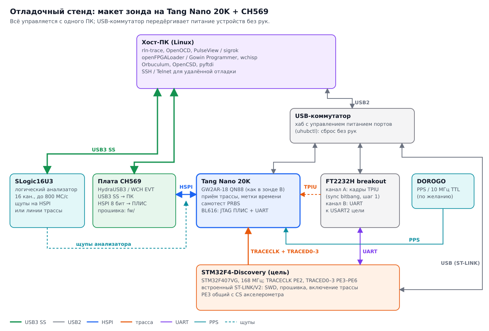

# Отладочный стенд

Стенд для макета зонда B: Tang Nano 20K вместо своей ПЛИС-части, готовая плата CH569 вместо своего
USB3-моста. На нём проходят шаги 0–6 [плана проверки](../hw/README.md#9-план-проверки) до того,
как появится своя плата.

## Что где и для чего

| Элемент | Подключение | Зачем |
|---|---|---|
| **Хост-ПК (Linux)** | USB3 к плате CH569 и SLogic16U3, USB2 к коммутатору | Запись потока (`rln-trace`), OpenOCD, PulseView/sigrok, прошивка ПЛИС (openFPGALoader / Gowin Programmer) и CH569 (wchisp), Orbuculum и OpenCSD для разбора трассы |
| **Плата CH569** (HydraUSB3 или WCH EVT) | USB3 SS напрямую в ПК; HSPI 8 бит к Tang Nano 20K | USB3-мост будущего зонда: прошивка из [`fw/`](../fw/), замер пропускной способности HSPI → USB |
| **Tang Nano 20K** | USB2 через коммутатор (встроенный BL616: JTAG ПЛИС + UART); HSPI к CH569; входы трассы от цели | Та же ПЛИС GW2AR-18 QN88, что в зонде B: приём TPIU, метки времени, генератор PRBS для самотеста. Гейтвар из [`gw/`](../gw/) |
| **USB-коммутатор** | USB2 в ПК; к нему Tang Nano 20K, FT2232H, STM32F4-Discovery | Хаб с управлением питанием портов (`uhubctl`): передёрнуть зависшее устройство или сбросить цель по питанию удалённо, без рук |
| **SLogic16U3** | USB3 SS напрямую в ПК; щупы на HSPI или линии трассы | Смотреть, что реально идёт по проводам: тайминги HSPI, фазу TRACECLK относительно данных, порядок нибблов |
| **STM32F4-Discovery** (цель) | USB встроенного ST-LINK через коммутатор; TRACECLK PE2, TRACED0–3 PE3–PE6 → Tang Nano 20K; USART2 (PA2/PA3) ↔ FT2232H; PPS с выхода таймера → Tang Nano 20K | STM32F407VG на 168 МГц — ровно наш худший случай (TRACECLK 84 МГц DDR). Встроенный ST-LINK/V2 прошивает цель и включает трассу через OpenOCD, пока своего SWD-движка нет. Цель сама выдаёт PPS — внешний генератор на стенде не нужен |
| **FT2232H breakout v1.0** | USB2 через коммутатор; канал A → входы трассы Tang Nano 20K; канал B ↔ USART2 цели | Канал A в режиме sync bitbang выдаёт заранее известные кадры TPIU (шаг 1): поток готовится на ПК (pyftdi / libftdi), так что любой вектор, включая записанный с настоящей цели или заведомо битый, подаётся без перепрошивки. Канал B — UART-консоль теста на цели |

## USB-топология

- **USB3 — только напрямую в порты ПК**, без хаба: CH569 и SLogic16U3 упираются в полосу, и общий хаб
  делит её между ними. Желательно на разные корневые контроллеры (`lsusb -t`).
- **USB2-устройства — через коммутатор.** Им полоса не важна, зато важен удалённый сброс по питанию.
  Отключение порта Tang Nano 20K сбрасывает и ПЛИС, и её UART.
- F4-Discovery питается от USB встроенного ST-LINK: выключение её порта на коммутаторе — полный сброс цели по питанию.

## Проводка

- **HSPI 8 бит:** HD0–HD7 и линии управления HSPI (такты и рукопожатие передачи и приёма) между платой CH569 и Tang Nano 20K.
  Провода короткие (до 10 см) и одной длины, у каждого второго — земля рядом. HD0 не тянуть вниз при
  включении CH569: попадём в загрузчик.
- **Трасса:** TRACECLK и TRACED0–3 с цели на входы Tang Nano 20K, TRACECLK — на тактовый вход ПЛИС.
  Уровни 3,3 В с обеих сторон, транслятор на макете не нужен. Последовательные 33 Ом у цели.
- **FT2232H, канал A → трасса:** ADBUS0 — TRACECLK, ADBUS1–4 — TRACED0–3. Каждый записанный байт — одно
  состояние линий, тактовый бит переключается в каждом байте, поэтому данные меняются по обоим фронтам,
  как у настоящего TPIU. Скорость — сотни кГц, для проверки логики деформатора этого достаточно.
  На время шага 1 цель от входов трассы отключается.
- **FT2232H, канал B ↔ цель:** BDBUS0 (TXD) → PA3 (USART2_RX), BDBUS1 (RXD) ← PA2 (USART2_TX).
- **F4-Discovery:** перемычки CN3 стоят — встроенный ST-LINK подключён к своему STM32F407.
  PE3 (TRACED0) на плате ещё идёт на CS акселерометра: линия нагружена сильнее остальных. Если на высокой
  частоте ошибки будут именно на D0, сначала подстроить задержку этой линии в ПЛИС, крайний вариант —
  снять акселерометр.
- **PPS от цели:** выход таймера STM32 (например, TIM1_CH1 на PA8 — проверить по схеме платы, что вывод
  свободен) → вход событий Tang Nano 20K. Отдельный провод рядом с землёй, как у линий трассы.
- **Общая земля** у всех плат: соединять земли толстым проводом в одной точке, а не только через USB.
- **Щупы SLogic16U3** — параллельно линиям, без отвода в сторону; земля щупа — рядом с измеряемым сигналом.
- Конкретные выводы Tang Nano 20K фиксируются в файле ограничений гейтвара (`gw/`), а не здесь.

## Порядок работы

| Шаг плана | Что включено | Как |
|---|---|---|
| 0 | ПК + CH569 + Tang Nano 20K | ПЛИС гонит PRBS → HSPI → USB3 → файл; ПК сверяет последовательность. SLogic16U3 на HSPI, если есть ошибки |
| 1 | + FT2232H | Медленные кадры TPIU с известным содержимым, проверка деформатора |
| 2 | Tang Nano 20K сама с собой | Петля: генератор трассы на одних выводах, приём на других, полная частота |
| 3 | + STM32F4-Discovery | ITM-счётчик в стимул-порт. HCLK сначала 48 МГц (TRACECLK 24 МГц), затем 84 и 168 МГц |
| 4 | то же | ETM, декодирование OpenCSD на известной программе |
| 5 | то же | PPS от таймера цели: метки в журнале событий, поиск начала и конца интервала PPS–PPS в потоке, сверка с ITM-маркерами |
| 6 | F4-Discovery без ST-LINK | Свой движок SWD/JTAG, см. ниже |

## Тест PPS на самой цели

Внешний GNSS-генератор для отработки логики не нужен: импульс выдаёт сама STM32F407, и мы заранее знаем,
где в её трассе он должен оказаться.

- **Импульс.** Таймер в режиме PWM: период 1 с (для быстрых прогонов — 1–10 мс), длительность 1–100 мкс.
  Период и длительность меняются из теста, чтобы проверять разные длины интервала и короткие импульсы.
- **Маркер в трассе.** В прерывании того же таймера по фронту цель пишет в стимул-порт ITM номер импульса.
  Для ETM прерывание само видно в трассе как исключение.
- **Что делает зонд.** ПЛИС ставит метку времени на фронт PPS и привязывает её к номеру кадра трассы.
  Утилита на ПК находит фронты N и N+1 и вырезает кусок трассы между ними.
- **Что проверяем.**
  - Начало и конец интервала: первый кадр после фронта N содержит ITM-маркер N (с учётом задержки FIFO
    ETM внутри цели), последний кадр до фронта N+1 не содержит маркера N+1.
  - Нет пропущенных и лишних импульсов: номера маркеров идут подряд, число меток PPS совпадает с ними.
  - Разброс задержки «фронт PPS → маркер в трассе» по многим импульсам — это и есть точность привязки.
  - Поведение при переполнении буфера и потере синхронизации: интервал с потерями должен помечаться,
    а не молча склеиваться.
- **Эталон.** SLogic16U3 на PPS и TRACECLK — для разбора спорных случаев.

Настоящий GNSS-генератор нужен позже — для проверки опоры 10 МГц и долгой стабильности счётчика.

## Отладка SWD/JTAG

Сначала доводим трассу: это главный риск проекта и то, чего нет в открытых зондах. Движок SWD/JTAG —
известная задача (протокольное ядро [free-dap](https://github.com/ataradov/free-dap), примеры в ORBTrace),
поэтому он идёт следующим шагом и на том же стенде, без новых плат.

- **Подключение.** Снимаем обе перемычки CN3 на F4-Discovery: встроенный ST-LINK отключается от своего
  STM32F407. Выводы цели берём с гребёнок P1/P2 и ведём к Tang Nano 20K:

  | Сигнал | Вывод STM32F407 |
  |---|---|
  | SWDIO / TMS | PA13 |
  | SWCLK / TCK | PA14 |
  | TDI | PA15 |
  | SWO / TDO | PB3 |
  | nTRST | PB4 |
  | nRESET | NRST |

  Выводы трассы на порте E с отладочными не пересекаются, трассу и отладку можно гонять одновременно.
- **Управление движком.** Сначала — через UART встроенного BL616 Tang Nano 20K простыми командами
  (чтение IDCODE, DP/AP-регистры, чтение памяти). Затем CMSIS-DAP v2 на CH569 поверх HSPI, и тогда
  OpenOCD, pyOCD и probe-rs подключаются как к обычному отладчику.
- **Эталоны для сравнения.**
  - Встроенный ST-LINK (с перемычками CN3 на месте) — та же цель, заведомо рабочий отладчик.
  - FT2232H — у обоих каналов есть MPSSE, на время этого шага канал B можно перевести из UART в JTAG
    (OpenOCD, интерфейс ftdi) и получить эталон 4-проводного JTAG.
  - SLogic16U3 со щупами на SWDIO/SWCLK или на линиях JTAG: декодеры sigrok покажут транзакции нашего
    движка и эталона рядом.

Схема стенда генерируется скриптом [`tools/diagrams/make_diagrams.py`](../tools/diagrams/make_diagrams.py).
