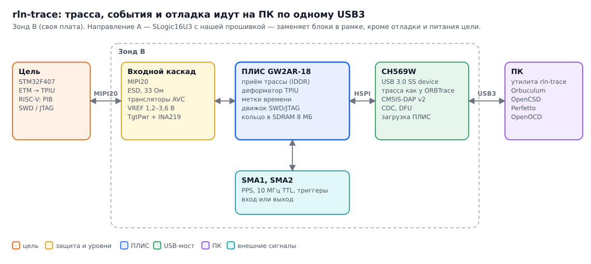
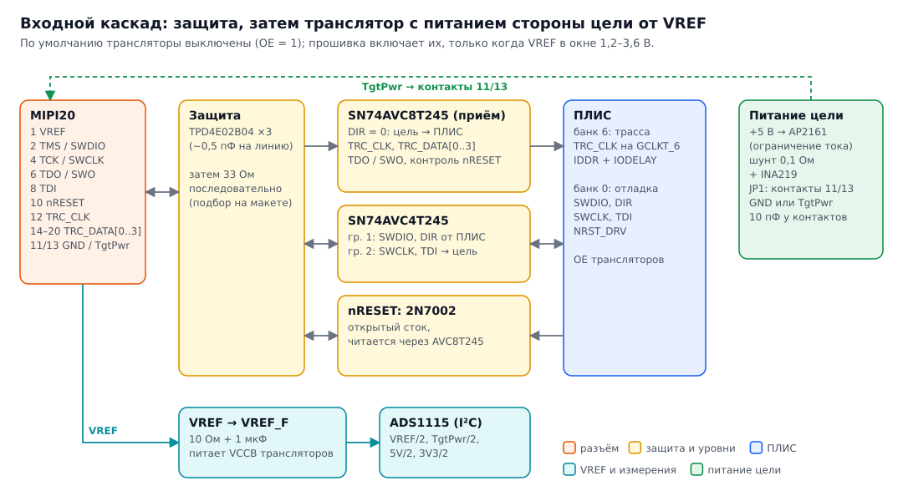
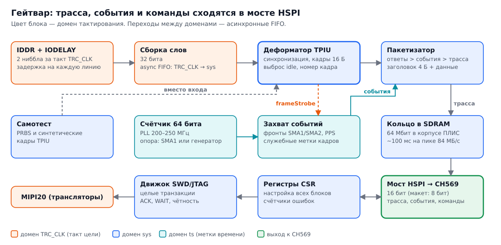
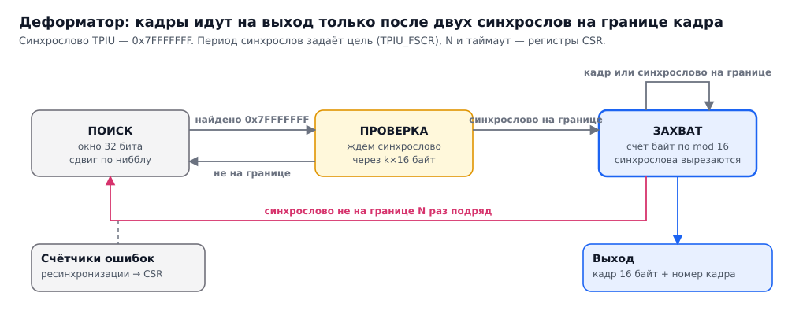
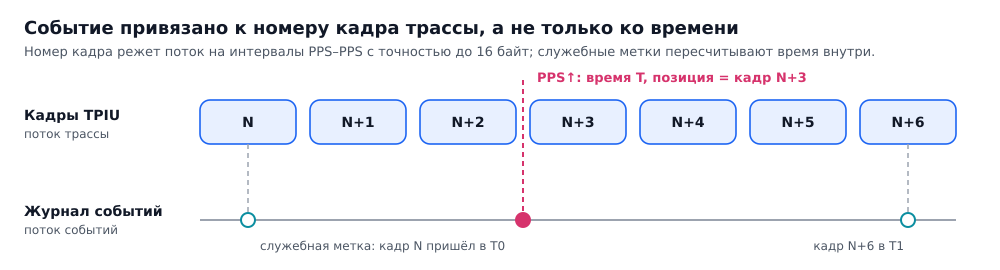

# Аппаратура rln-trace: архитектура

Документ описывает зонд направления B (своя плата) и то, что из него переиспользуется в направлении A
(альтернативная прошивка Sipeed SLogic16U3). Схема rev 0.1 лежит в [`probe-b/`](probe-b/).

## 1. Требования

| ID | Требование | Значение / решение |
|---|---|---|
| R1 | Трасса | Полный ETM (Cortex-M) через TPIU; RISC-V через PIB; 1/2/4 бита, такт от цели, выборка по обоим фронтам |
| R2 | Скорость порта | STM32F407: TRACECLK 84 МГц DDR × 4 бита = 84 МБ/с пик; потолок MIPI20 — около 100 МБ/с |
| R3 | Режим захвата | Непрерывный поток на ПК; минимум — полный интервал между двумя PPS (≤ 84 МБ) |
| R4 | Метки событий | PPS, SMA1, SMA2, маркеры; шаг единицы нс; привязка к номеру кадра трассы |
| R5 | Отладка | SWD и 4-проводной JTAG; CMSIS-DAP v2 |
| R6 | Разъём цели | MIPI20 по RISC-V Trace Connectors 1.0 (совпадает с Cortex Debug+ETM); Mictor не поддерживается |
| R7 | Уровни | VREF 1,2–3,6 В, трансляторы, защита от ESD и перенапряжения, Hi-Z по умолчанию |
| R8 | Внешние разъёмы | USB-C (USB 3.2 Gen1), SMA1 и SMA2 — двунаправленные триггеры; SMA1 может быть опорой 10 МГц (TTL) |
| R9 | Питание цели | 5 В на контакты 11/13 MIPI20 через ключ с ограничением тока, с измерением тока |
| R10 | Монтаж | Только QFP/QFN, ПЛИС в QN88 |
| R11 | Совместимость | Интерфейс трассы повторяет ORBTrace, Orbuculum работает без патчей |
| R12 | Тулчейн | Открытый (Yosys + nextpnr/Apicula) и проприетарный Gowin EDA |

Вне рамок rev 0.1: функции логического анализатора (их закрывает SLogic16U3), Mictor-38, cJTAG, RVSWD,
выдача TRIGIN в цель.

## 2. Структурная схема

| | A: прошивка SLogic16U3 | B: свой зонд |
|---|---|---|
| ПЛИС | Gowin GW5AT-LV15 (CSP), USB3 на встроенных SerDes | Gowin GW2AR-18 QN88, 64 Мбит SDRAM в корпусе |
| USB3 | IP-ядро Gowin в ПЛИС | CH569W (QFN68), HSPI к ПЛИС |
| Функции | трасса + события на свободных каналах | трасса + события + SWD/JTAG + TgtPwr + UART |
| Вход | компараторы с порогом 0–6 В, только приём | трансляторы от VREF, вход и выход |
| Тулчейн | только Gowin EDA | Gowin EDA и открытый |
| Главный риск | схема закрыта, неизвестна разводка тактовых входов | объём работы, целостность сигнала на 100 МГц DDR |

Всё, что зависит только от протокола трассы (приём TPIU, метки времени, пакетизация, формат потоков,
утилита на ПК), пишется один раз и переносится между Tang Nano 20K, SLogic16U3 и своей платой.

## 3. Внешние интерфейсы

### MIPI20 (контакты по RISC-V Trace Connectors 1.0)

| Контакт | Сигнал | Направление (от зонда) | Примечание |
|---|---|---|---|
| 1 | VREF | вход | Питает сторону цели у трансляторов, измеряется АЦП |
| 2 | TMS / SWDIO | двунаправленный | Направление переключает ПЛИС |
| 4 | TCK / SWCLK | выход | |
| 6 | TDO / SWO | вход | SWO — UART или Manchester |
| 8 | TDI | выход | |
| 9 | GNDDetect | — | На зонде всегда земля |
| 10 | nRESET | открытый сток + контроль | Зонд видит сбросы цели |
| 11, 13 | GND / TgtPwr | выход 5 В | Перемычка JP1, по умолчанию GND |
| 12 | TRC_CLK | вход | На тактовый вход ПЛИС |
| 14, 16, 18, 20 | TRC_DATA[0..3] | вход | |
| 3, 5, 7, 15, 17, 19 | GND | — | |

### USB-C

USB 3.2 Gen1 через CH569. Ориентацию разъёма определяет компаратор по линии CC1, пары SuperSpeed
переключает мультиплексор CBTL02043A. USB2 HS остаётся для DFU и как запасной путь.

### SMA1, SMA2

Двунаправленные 3,3 В LVCMOS, по умолчанию вход. Транслятор с выводом направления (SN74LVC1T45),
33 Ом последовательно (согласование с коаксиалом 50 Ом), TVS, отключаемая нагрузка 50 Ом.
SMA1 заведён на вход PLL ПЛИС и может быть опорой 10 МГц (TTL-выход GNSS-генератора). Синус не принимается.

## 4. Входной каскад

Каждая линия MIPI20: TVS-массив у разъёма → 33 Ом → транслятор.

- **Трасса, TDO, контроль nRESET** — SN74AVC8T245 на приём (DIR = 0, B → A).
- **SWDIO, SWCLK, TDI** — SN74AVC4T245: группа 1 двунаправленная (SWDIO), группа 2 на выход.
- **nRESET** — открытый сток на 2N7002, состояние читается обратно через транслятор.
- Сторона цели трансляторов питается от VREF через фильтр 10 Ом + 1 мкФ. Семейство AVC работает от 1,2 В,
  имеет Ioff и изоляцию по VCC: при VREF = 0 выходы в Hi-Z.
- После включения оба транслятора выключены (OE подтянут вверх). Прошивка включает их,
  только когда VREF в окне 1,2–3,6 В (ADS1115, канал 0).
- Питание цели: AP2161 (ограничение тока, флаг перегрузки), шунт 0,1 Ом + INA219,
  на контактах 11/13 10 пФ по спецификации.

## 5. ПЛИС: раскладка и гейтвар

GW2AR-LV18QN88C8/I7: 20 736 LUT4, 828 Кбит BSRAM, 64 Мбит SDR SDRAM в корпусе, 66 пользовательских выводов.
Распиновка — по Gowin UG115E v1.7.2 (колонка QN88 со SDRAM). Все VCCIO — 3,3 В
(выводы 3/12/64 — общая шина VCCX/VCCIO2/6/7).

| Банк | Назначение |
|---|---|
| 6 | Трасса: TRC_CLK на GCLKT_6 (вывод 10), данные на 17–20; TDO, контроль nRESET, OE трассы; SMA1 на LPLL2_T_in (13) |
| 7 | Генератор 50 МГц на LPLL1_T_in (4) |
| 0 | SWDIO, направление SWDIO, SWCLK, TDI, nRESET, OE отладки, светодиоды |
| 1 | Управление HSPI, HTCLK от CH569 на GCLKT_1 (77) |
| 4, 5 | Данные HSPI D0–D15 |
| 3 | MSPI-флеш, RECONFIG_N, MODE0/1, SMA2 на GCLKT_3 (63), направление SMA |
| 2 | JTAG ПЛИС |

Занято 49 выводов из 66, полная таблица — [`probe-b/kicad/pinmap.csv`](probe-b/kicad/pinmap.csv).

### Конвейер приёма трассы

1. **IDDR + IODELAY** (домен TRC_CLK): за такт два ниббла, задержка каждой линии настраивается.
2. **Сборка слов** 32 бита → асинхронный FIFO в системный домен.
3. **Поиск синхронизации:** окно 32 бита сравнивается с `0x7FFFFFFF` на всех сдвигах по нибблу.
4. **Выравнивание кадров:** счёт байт по модулю 16 от последнего синхрослова; синхрослова вырезаются.
5. **Фильтр idle:** пустые кадры отбрасываются.
6. **Нумерация:** каждый кадр получает 64-битный номер — по нему связываются трасса и события.

Автомат синхронизации деформатора:

Для RISC-V PIB есть «сырой» режим без деформатора.

### Метки времени

- Счётчик 64 бита на PLL 200–250 МГц от опоры (10 МГц с SMA1 или местный генератор).
- Запись события, 16 байт: тип (PPS, фронты SMA, служебная метка, ресинхронизация, переполнение),
  флаги, номер кадра трассы (48 бит), время (64 бита).
- Служебные метки «кадр N пришёл в момент T» идут периодически — по ним время пересчитывается
  внутри интервала. Для точной корреляции цель пишет ITM-маркер по PPS: задержка FIFO ETM внутри
  цели плавает.

### Буфер и мост HSPI

- Кольцо в SDRAM (8 МБ, ~100 мс на пике 84 МБ/с). Обратного давления на цель нет: при переполнении
  кадры теряются, в журнал пишется событие «переполнение».
- Пакетизатор с приоритетами: ответы на команды → события → трасса.
- HSPI 16 бит до 120 МГц (~237 МБ/с) к CH569; на макете 8 бит (~95–119 МБ/с).

### Языки

- **Chisel** — платформонезависимые ядра: деформатор, метки времени, пакетизатор, SWD/JTAG, CSR, мост HSPI.
- **Verilog** — платформенный слой: примитивы Gowin (IDDR, IODELAY, PLL, SDRAM), верхние модули плат.
- Тесты — ChiselSim + Verilator, сквозные прогоны на записях реального потока.

## 6. Отладка

CH569 разбирает CMSIS-DAP v2 (протокольное ядро [free-dap](https://github.com/ataradov/free-dap)),
а целые SWD/JTAG-транзакции выполняет движок в ПЛИС. Совместимость проверяется с OpenOCD, pyOCD и probe-rs.

## 7. USB-интерфейсы

| Интерфейс | Класс / подкласс | Содержимое |
|---|---|---|
| Трасса | 0xFF / 0x54 ('T'), протокол 0x01 (TPIU) | 16-байтные кадры TPIU, как у ORBTrace |
| События | 0xFF / свой подкласс | Записи по 16 байт |
| CMSIS-DAP v2 | 0xFF, строка «CMSIS-DAP» | Команды отладки |
| UART цели | CDC-ACM | Виртуальный UART |
| Управление | vendor requests | CSR ПЛИС, TgtPwr, VREF, ток, калибровка задержек |
| Обновление | DFU | Прошивка CH569 и битстрим ПЛИС одним образом |

Следующий шаг совместимости — протокол orbflow (Orbuculum 2.2+): события можно отдавать отдельным тегом.

## 8. Питание

USB 5 В → предохранитель → TLV62569 на 3,3 В (2 А) и TLV62569 на 1,0 В (ядро ПЛИС, включается по PG от 3,3 В).
VCCPLL ПЛИС — через ферритовую бусину. CH569 сам делает 1,2 В встроенным LDO.

## 9. План проверки

Стенд для шагов 0–6 описан в [`doc/bench.md`](../doc/bench.md).

| Шаг | Стенд | Что проверяем |
|---|---|---|
| 0 | ПЛИС + CH569 | PRBS → HSPI → USB → файл, многочасовая запись без ошибок |
| 1 | FT2232H на MIPI20 | Медленные кадры TPIU, порядок битов и фронтов |
| 2 | Петлевой переходник | Синтетическая трасса на полной частоте, движок SWD |
| 3 | STM32F407, ITM | Счётчик в стимул-порт, HCLK 48 → 84 → 168 МГц |
| 4 | STM32F407, ETM | Декодирование OpenCSD на известной программе |
| 5 | GNSS-генератор + PPS | Вырезание интервала PPS–PPS, согласование с ITM-маркером |
| 6 | STM32F407 без ST-LINK | Свой движок SWD/JTAG, сравнение с ST-LINK и FT2232H |

## 10. Открытые вопросы rev 0.1

1. Посадка QN88 нарисована по номинальным размерам — сверить с чертежом UG229.
2. Центральная площадка CH569W QFN68 — по даташиту CH569DS1.
3. PB15 = HD14 одновременно RST# CH569: отключить RST# в конфигурации до работы HSPI 16 бит.
4. MODE[1:0] = 00 → MSPI (UG290, табл. 5-2) — проверить.
5. Полярность SEL у CBTL02043A и выбор разъёма USB-C на 24 контакта.
6. Номиналы 33 Ом на линиях трассы — подобрать на макете.
